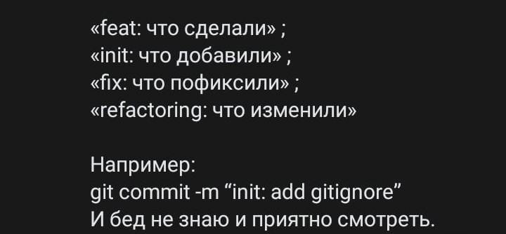

# Society

## Документация по вложенным папкам *Assets*:

- Animations — анимации;
- Audio — open-source звуки, музыка;
- Balance - баланс, таблицы;
- Fonts — наши шрифты;
- Images - open-source спрайты, фотографии;
- Models — open-source модели, текстуры;
- NormalAudio — наши звуки, музыка;
- NormalImages — наши спрайты, фотографии;
- NormalModels — наши модели, текстуры;
- Plugins — плагины;
- Prefabs — префабы;
- Presets — настройки импорта ресурсов;
- Samples — фрагменты кода примеров, некоторые шейдеры, текстуры или анимации;
- Scenes — сцены;
- Scripts — скрипты;
- Settings — настройки графического пайплайна;
- Shaders — кастомные шейдеры и визуальные эффекты;
## Как оформлять коммиты

## В стандартных папках сцены содержатся:
- Common — подвижное окружение;
- Enviroment — неподвижное окружение;
- Scene — сюжетные компоненты, триггеры;
- Camera — зритель || игрок;
- Characters — неигровые персонажи;
- UI — пользовательский интерфейс;
- Other — некоторые абстрактные объекты.